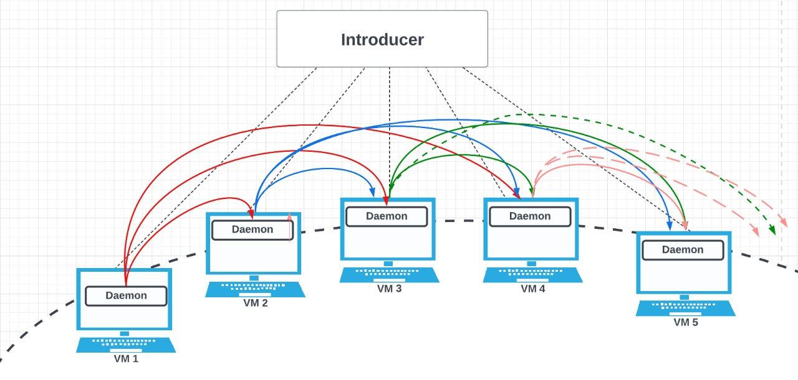

# Distributed Failure detector.

Girija Manoj Kumar Reddy

Santosh Kumar Chejarla


### SET UP
---
 #### requirements
    - python3
    - ansible (optional)


Architecture:

Our failure detector organizes the processes into a ring structure. Every process in the ring will monitor the three active processes after its position in the ring and pings them every 1s Every process will be monitored by its three active processes before it. As TCP is reliable, we use it for Introducer communication and UDP protocol for every other communication.





## Usage

1. First the introducer should be triggered

```
[user]$ python3 introducer.py
```

2. Then each node can join the system

```
[user]$ python3 daemon.py 
```

### Commands

1. join: To join the system

```
$join
```

2. list_mem: will give the membership list of that process

```
$list_mem
+--------------------------+
|       Process IDs        |
+--------------------------+
| fa22-cs425-1902:23:04:12 |
| fa22-cs425-1903:23:04:20 |
+--------------------------+
```

3. list_self: To get the current process id

```
$list_self
fa22-cs425-1901:23:04:40
```

4. leave: To leave the system

```
$leave
```
