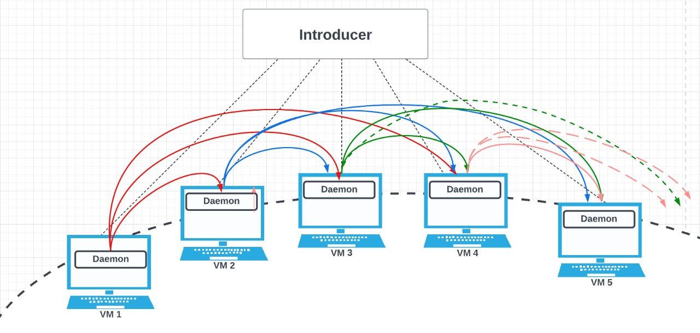

# Simple Distributed File System(SDFS)

Girija Manoj Kumar Reddy

Santosh Kumar Chejarla


### SET UP
---
 #### requirements
    - python3


Architecture:

Our failure detector organizes the processes into a ring structure. Every process in the ring will monitor the three active processes after its position in the ring and pings them every 1s Every process will be monitored by its three active processes before it. As TCP is reliable, we use it for Introducer communication and UDP protocol for every other communication.

Our SDFS is designed on top of ring architecture failure detector that we used in Distributed Failure detector. In our SDFS design, we will have total 4 replicas for each file in the SDFS. This is done to tolerate the 3 simultaneous failures. We replicate entire file and not splitting into shards. We chose not to do caching as it has only limited benefits. We will be using TCP connections for file exchanges.





## Usage

1. First the introducer should be triggered

```
[user]$ python3 introducer.py
```

2. Then each node can join the system

```
[user]$ python3 daemon.py
```

### Commands

1. join: To join the system

```
$join
```

2. list_mem: will give the membership list of that process

```
$list_mem
+--------------------------+
|       Process IDs        |
+--------------------------+
| fa22-cs425-1902:23:04:12 |
| fa22-cs425-1903:23:04:20 |
+--------------------------+
```

3. list_self: To get the current process id

```
$list_self
fa22-cs425-1901:23:04:40
```

4. leave: To leave the system

```
$leave
```

5. put: To upload a file the system

```
$put local_file_name sdfs_file_name
```

6. get: To download a file from the system
```
$get sdfs_file_name local_file_name
```

7. get-versions: To download N available versions of a file from the system
```
$get-versions sdfs_file_name N local_file_name
```

8. delete: To download all available versions of a file from the system
```
$delete sdfs_file_name
```

9. ls: To list the processes/nodes where a particular file is present
```
$ls sdfs_file_name
```
```
$ls vm1.log
+--------------------------+
|       Process IDs        |
+--------------------------+
| fa22-cs425-1901:20:57:30 |
+--------------------------+
```

10. store: To list all versions of all files store at the node from where the command is executed
```
$store
```
```
$store
+-----------------+
| SDFS File Names |
+-----------------+
|    vm1_v0.log   |
+-----------------+
```
