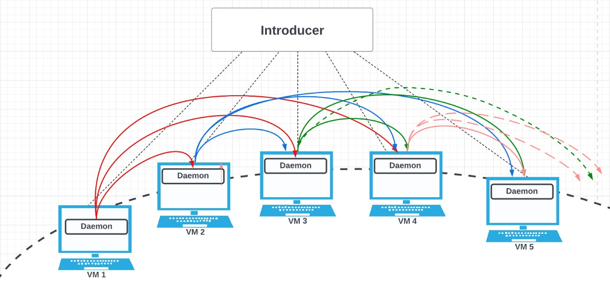

**Distributed Learning Cluster**

Girija Manoj Kumar Reddy

Santosh Kumar Chejarla


### SET UP
---
 #### requirements
    - python3


Architecture:

Our failure detector organizes the processes into a ring structure. Every process in the ring will monitor the three active processes after its position in the ring and pings them every 1s Every process will be monitored by its three active processes before it. As TCP is reliable, we use it for Introducer communication and UDP protocol for every other communication.

Our SDFS is designed on top of ring architecture failure detector that we used in Distributed Failure Detector. In our SDFS design, we will have total 4 replicas for each file in the SDFS. This is done to tolerate the 3 simultaneous failures. We replicate entire file and not splitting into shards. We chose not to do caching as it has only limited benefits. We will be using TCP connections for file exchanges.

Our ***Distributed Learning Cluster*** uses the models LeNet with MNIST data set and Resnet-50 with flowers dataset. When an user submits the request from any VM to start the Job along with the batch size, this request will reach the Co-ordinator and Co-ordinator assigns a Job_Id to the Job and then allocate the VMs for this Job. These allocated VMs will be stored as allocated_vms list for each job and These VMs are decided by the Co-ordinator based on the active VMs and ongoing Jobs in the cluster at that moment.  To VMs present in allocated_vms list, all the tasks of a Job will be distributed in a round robin fashion. After completion of every inference task, respective VM will send an ACK to the Co-ordinator. Only then the Co-ordinator assigns a next task to that VM. In this way, tasks will never queue up near any VM and at any point of time only one task will be executed at a VM.

Co-ordinator maintains the information like allocated_vms list, and the remaining tasks list for each Job. Immediately after every update to this information, Co-ordinator shares this information to Standby Co-ordinator

Co-ordinator constantly monitors the query rates for the jobs in progress. If the gap is more than 10% in the query rates then it updates the allocated_vms of the Jobs inorder to make sure the gap is less than 10%.





## Usage

1. First the introducer should be triggered

```
[user]$ python3 introducer.py
```

2. Then each node can join the system

```
[user]$ python3 daemon.py
```

### Commands

1. join: To join the system

```
$join
```

2. list_mem: will give the membership list of that process

```
$list_mem
+--------------------------+
|       Process IDs        |
+--------------------------+
| fa22-cs425-1902:23:04:12 |
| fa22-cs425-1903:23:04:20 |
+--------------------------+
```

3. list_self: To get the current process id

```
$list_self
fa22-cs425-1901:23:04:40
```

4. leave: To leave the system

```
$leave
```

5. put: To upload a file the system

```
$put local_file_name sdfs_file_name
```

6. get: To download a file from the system
```
$get sdfs_file_name local_file_name
```

7. get-versions: To download N available versions of a file from the system
```
$get-versions sdfs_file_name N local_file_name
```

8. delete: To download all available versions of a file from the system
```
$delete sdfs_file_name
```

9. ls: To list the processes/nodes where a particular file is present
```
$ls sdfs_file_name
```
```
$ls vm1.log
+--------------------------+
|       Process IDs        |
+--------------------------+
| fa22-cs425-1901:20:57:30 |
+--------------------------+
```

10. store: To list all versions of all files store at the node from where the command is executed
```
$store
```
```
$store
+-----------------+
| SDFS File Names |
+-----------------+
|    vm1_v0.log   |
+-----------------+
```

11. train: To train model
```
$train
```
```
$train
Models are ready for inference
```

12. infer: To submit inference job
```
$infer model dataset batch_size
```
```
$infer lenet lenet.png 5
Inference job submitted
```

13. job_info: To get all jobs information submited by user
```
$job_info
```
```
$job_info
+--------+----------+-------------+------------+-----------+
| Job ID | Job Type |  Job Status | Batch_size |  Dataset  |
+--------+----------+-------------+------------+-----------+
|   0    |  lenet   | IN_PROGRESS |     2      | lenet.png |
+--------+----------+-------------+------------+-----------+
```

14. job_stats: To get all jobs stats
```
$job_stats
```
```
$job_stats
+--------+-------+----------+----------+----------+----------+----------+-------------+------------+---------------------+
| Job ID | Count |   mean   |   std    |   25%    |   75%    |   99%    | 10_sec_rate | total_rate |    assigned_nodes   |
+--------+-------+----------+----------+----------+----------+----------+-------------+------------+---------------------+
|   0    |   10  | 3.752005 | 4.811626 | 1.182343 | 1.812465 | 13.40399 |     0.0     |  0.489572  |          []         |
|   1    |   1   | 0.681223 |   0.0    | 0.681223 | 0.681223 | 0.681223 |     0.1     |  0.706512  | ['fa22-cs425-1901'] |
+--------+-------+----------+----------+----------+----------+----------+-------------+------------+---------------------+
```

15. upload_data: To upload bulk dataset to sdfs based on regex pattern

e.g: datast lenet.png uploads all files in the format lenet.*.png
```
$upload_data dataset count
```
```
$upload_data lenet.png 50
dataset uploaded successfully
```
