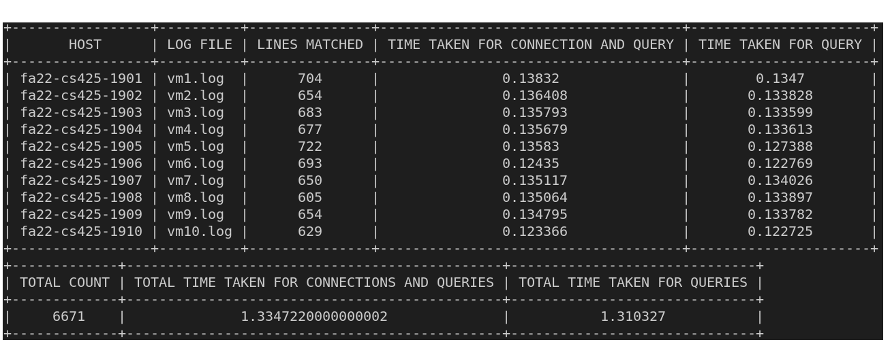
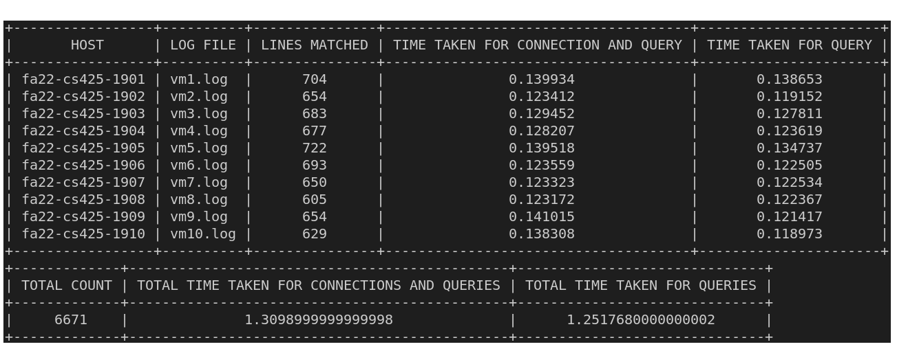
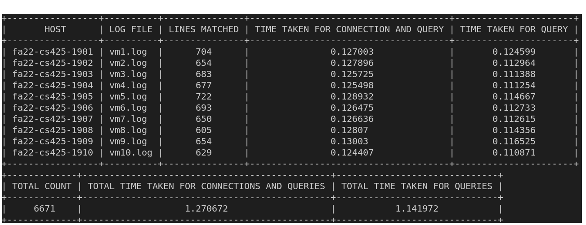
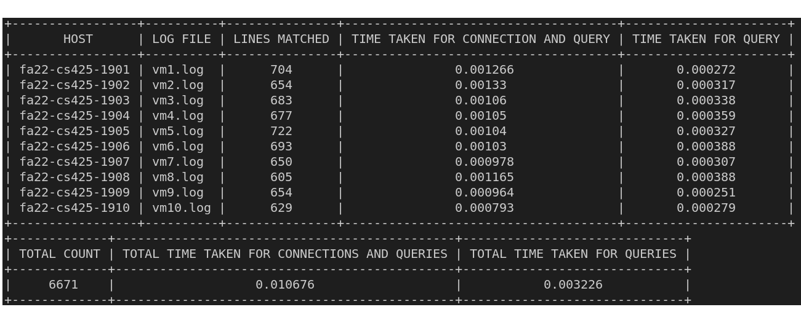
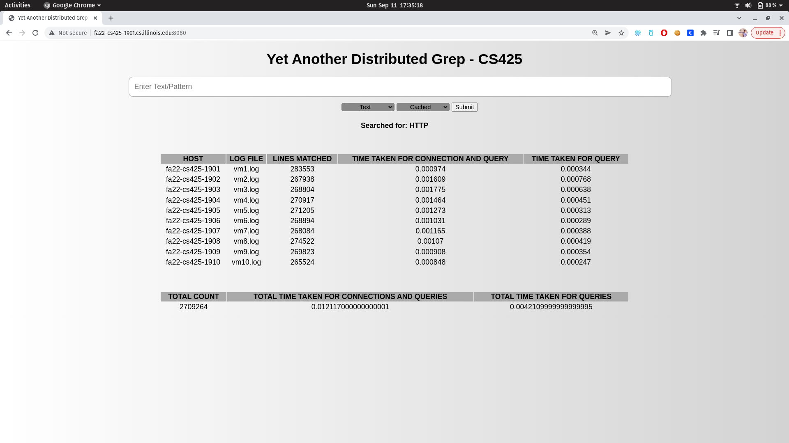

# Distributed Log Grepper

Members:
- Girija Manoj Kumar Reddy Kalakoti

- Santosh Kumar Chejarla


### SET UP
---
 #### requirements
    - python3
    - ansible (optional)


#### pip requirements
    - prettytable
    - flask
    - argparse
    - pytest

#### Start Servers and dashboard via Ansible
Run the following commands on VM1
```
cd ansible/
ansible-playbook start_servers.yaml
ansible-playbook start_dashboard.yaml
```

OR

#### Start Servers and Web dashboard manually
Run the following on all VMs
```
python3 server.py
python3 dashboard.py
````

### Usage
----
#### CLI:
```
[user]$ python3 client.py 
usage: client.py [-h] [--pattern PATTERN] [--text TEXT] [--cached CACHED]

optional arguments:
  -h, --help            show this help message and exit
  --pattern PATTERN, -p PATTERN
                        Query pattern
  --text TEXT, -t TEXT  Query text
  --cached CACHED, -c CACHED
                        Cached grep: 0 for no_cache and 1 for cached
```







#### Web UI:

Go to port 8080 of any server to get the web ui.

e.g: http://fa22-cs425-1901.cs.illinois.edu:8080/


